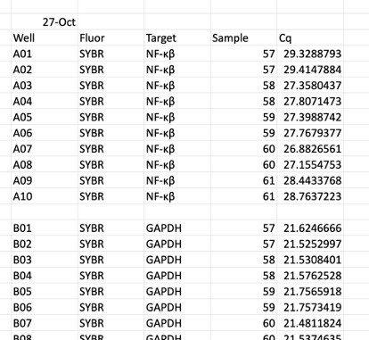
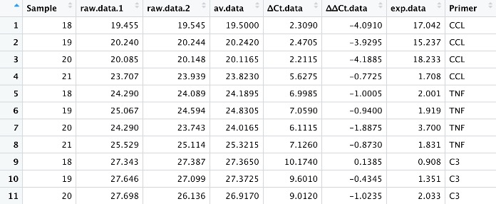
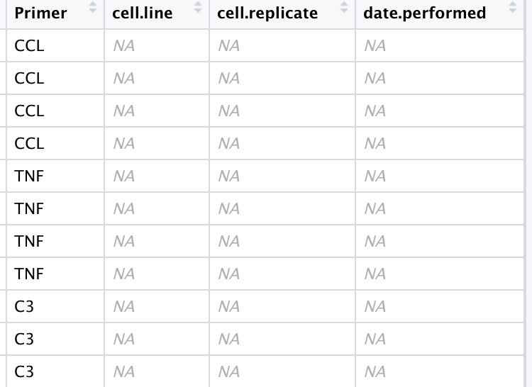

```{r, include = FALSE}
knitr::opts_chunk$set(
  collapse = TRUE,
  comment = "#>"
)
```


<!-- badges: start -->
<!-- badges: end -->

The goal of WesCell is to faciliate and acceralte the process of analyzing sample cells for Wesleyan students. This package is created for people without background knowledge of coding in hope that it will streamline the data manipulation and analysis process. 

## Installation

You can install the released version of WesCell with the following code:

``` {r, eval = FALSE}
if (!require(devtools)){
  install.packages("devtools")
 }
 
 devtools::install_github("qqcher/WesCell")
```

## Example

This is a basic example which shows how to import your raw RT-qPCR csv file:

```{r, eval = FALSE} 
library(WesCell)
result <- analyze.qPCR("your raw RT-qPCR csv file")
```

 
  
  Above picture is an example of a raw RT-qPCR csv file. The package will read your raw RT-qPCR csv file as a list. 


 
  After importation, rhe raw RT-qPCR csv file will be read as shown in the above picture.

  To convert the list into a dataframe and clean the dataframe, use the following code:
```{r, eval = FALSE}
mydata <- list.to.df(result)
mydata <- clean.data(mydata)
```



  After the previous two steps, your data should be ready for further analysis. Following are some of the tests you can run:

```{r, eval = FALSE}
## Willcoxon Test
Wilcoxon <-  df.wilcoxon.test(mydata,"Primer","inflammatory.factor","exp.data","cell.line")

## 3sub Unique Average
sub_average <- df.3sub.unique.av(mydata,"Primer","inflammatory.factor","exp.data","cell.line")

## T-test
T_test <- df.t.test(mydata,"Primer","inflammatory.factor","exp.data","cell.line")
```

  In addition to the tree tests, WesCell allows you to add variable via the console:
```{r, eval = FALSE}
add.variable.one(mydata)
```
  Once this function is inputted, the console will prompt you with the question "What is the name of the new variable?" To which, you can simply reply with the name of the variable without or without quotation marks. The example picutre is below:
  
  
  
  You can also add various variables to your dataframe with the following code:
```{r, eval = FALSE}
mydata <- add.variable.bulk(mydata,c("cell.line","cell.replicate","date.performed"))
```
  Different from the function `add.variable.one`, this function does not prompt a message in the console. Instead, you will have to some level of coding. The first argument of the function will be the name of dataframe that you are appending. The second argument will be the name/names of new varaibles added. The difference between `add.variable.one` and `add.variable.bulk`, like their name suggests, is that the later can input several new variables at the same time. 
  
  

  After new variables are added, you can manuling input the values. 
