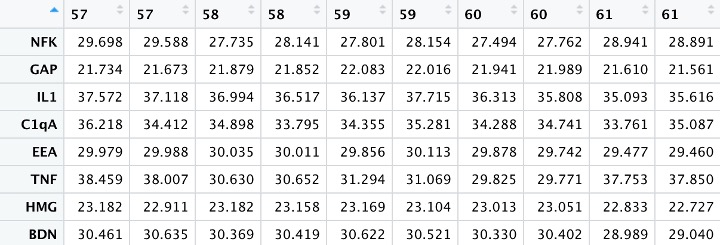

```{r, include = FALSE}
knitr::opts_chunk$set(
  collapse = TRUE,
  comment = "#>"
)
```


<!-- badges: start -->
<!-- badges: end -->

The goal of WesCell is to faciliate and acceralte the process of analyzing sample cells for Wesleyan students. This package is created for people without background knowledge of coding in hope that it will streamline the data manipulation and analysis process. 

## Installation

You can install the released version of WesCell with the following code:

``` {r, eval = FALSE}
if (!require(devtools)){
  install.packages("devtools")
 }
 
 devtools::install_github("qqcher/WesCell")
```

## Example

This is a basic example which shows how to import your raw RT-qPCR csv file:

```{r, eval = FALSE} 
library(WesCell)
result <- analyze.qPCR("your raw RT-qPCR csv file")
```


The package will read your raw RT-qPCR csv file as a list. To convert the list into a dataframe and clean the dataframe, use the following code:
```{r, eval = FALSE}
result_df <- list.to.df(result)
result_df <- clean.data(result_df)
```

After the previous two steps, your data should be ready for further analysis. Following are some of the tests you can run:

```{r, eval = FALSE}
## Willcoxon Test
Wilcoxon <-  df.wilcoxon.test(result_df,"Primer","inflammatory.factor","exp.data","cell.line")

## 3sub Unique Average
sub_average <- df.3sub.unique.av(df,"Primer","inflammatory.factor","Sample","exp.data","cell.line")

## T-test
T_test <- df.t.test(df,"Primer","inflammatory.factor","exp.data","cell.line")
```

